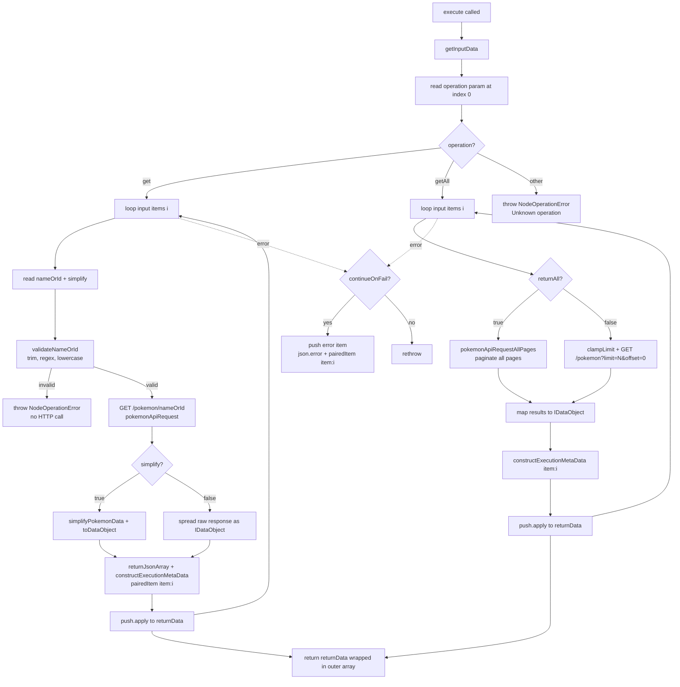
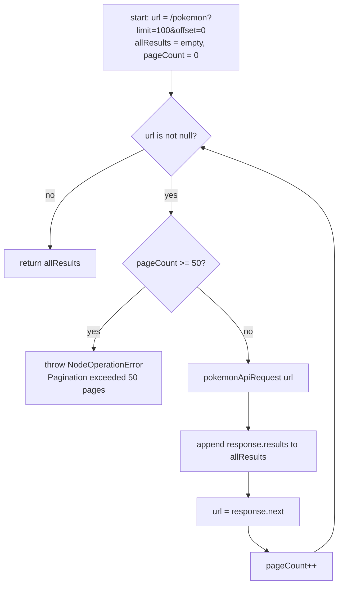
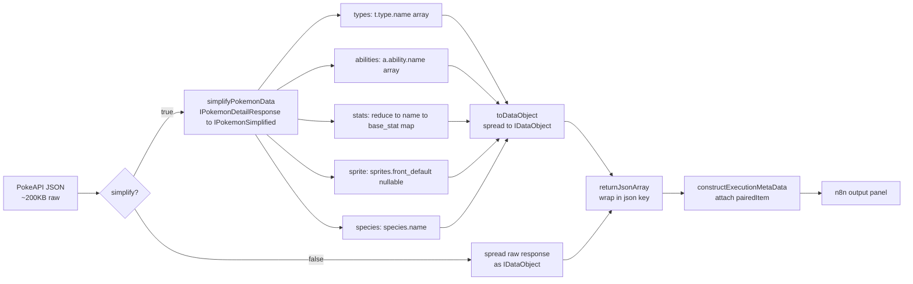
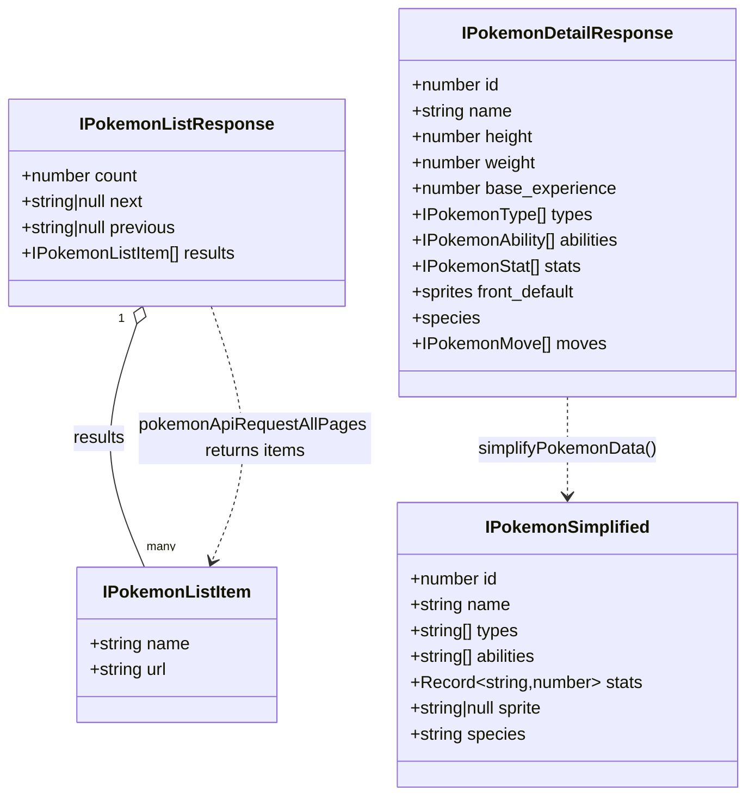

# Interview Prep — Pokemon Node Take-Home Debrief

A study guide for the live debrief. The interviewer will probe *how* you built it,
*what* you learned, and *how deeply* you understand your own submission. Every claim
below is grounded in the actual code, not the docs. File references are clickable.

**Code under discussion:**
- `packages/nodes-base/nodes/Pokemon/Pokemon.node.ts` — the `INodeType`, `execute()`
- `packages/nodes-base/nodes/Pokemon/GenericFunctions.ts` — request helpers, interfaces, validation, pagination, simplify
- `packages/nodes-base/nodes/Pokemon/PokemonDescription.ts` — UI / parameter definitions
- `packages/nodes-base/nodes/Pokemon/test/` — unit + workflow tests

---

## 1. The 60-Second Pitch (say this out loud)

> "It's a custom n8n node that wraps PokeAPI with two operations. **Get** fetches one
> Pokémon by name or numeric ID and, by default, *simplifies* the ~200KB raw response
> into a clean flat object — id, name, height, weight, base_experience, types,
> abilities, stats, sprite, species. **Get Many** lists Pokémon stubs (name + URL),
> with an optional Return All that paginates through every page.
>
> The design is deliberately *composable*: Get Many gives you an index, you Loop over
> it, and Get enriches each entry. They're separate operations because the list
> endpoint only returns stubs — enriching inline would be an N+1 call pattern that hides
> latency and abuses PokeAPI's fair-use policy.
>
> Under the hood it's a **programmatic** node — I needed real transform logic for
> simplify that you can't express readably in declarative routing. It's typed
> end-to-end with no `any`, validates input against an allowlist regex before building
> the URL, disables redirects, wraps every API call in `NodeApiError`, and has a
> pagination circuit breaker. 68 unit tests plus two workflow tests through
> n8n's `NodeTestHarness`."

Three things to emphasize because they're the differentiators:
1. **Composability** — separate Get/Get Many is a product decision, not a limitation.
2. **Typed, no `any`** — most candidates clone CoinGecko which uses `any` everywhere.
3. **Security hygiene on a read-only API** — validation, no redirects, circuit breaker.

---

## 2. How an n8n Programmatic Node Works (then how *this* node uses each piece)

An n8n node is a class implementing `INodeType`. Two members matter here:

| Piece | What it is | How this node uses it |
|---|---|---|
| `description: INodeTypeDescription` | Static metadata: name, icon, version, inputs/outputs, and the parameter UI | `Pokemon.node.ts:24-40`. Sets `usableAsTool: true`, `group: ['input']`, and pulls `properties` from `PokemonDescription.ts` |
| `execute()` | Runs per node execution. Returns `INodeExecutionData[][]` (array of output branches) | `Pokemon.node.ts:42-119` |
| `getInputData()` | The items flowing in from upstream nodes | `Pokemon.node.ts:43` |
| `getNodeParameter(name, i, fallback)` | Reads a UI parameter for input item `i` | e.g. `Pokemon.node.ts:50-51` |
| **items loop** | Nodes process N input items; you loop and process each | `for (let i = 0; i < items.length; i++)` in both branches |
| `continueOnFail()` | User toggle: on error, emit an error item instead of throwing | `Pokemon.node.ts:69, 104` |
| `helpers.returnJsonArray(data)` | Wraps plain objects into `{ json: ... }` items | `Pokemon.node.ts:64, 99` |
| `helpers.constructExecutionMetaData(items, { itemData })` | Attaches `pairedItem` linkage so downstream nodes can correlate output→input | `Pokemon.node.ts:64-66, 98-101` |
| `helpers.httpRequest(options)` | The modern axios-based HTTP helper (NOT deprecated `request()`) | `GenericFunctions.ts:117` |
| paired items | The `{ item: i }` tag that maps each output back to its source input | set via `constructExecutionMetaData` and in the `continueOnFail` error item |

**Key subtlety — the return shape is `[returnData]`** (`Pokemon.node.ts:118`). The outer array
is *output branches* (this node has one Main output), the inner array is the items.

**Key subtlety — why `push.apply`** (`Pokemon.node.ts:62-67, 102`). `constructExecutionMetaData`
returns an *array* of items (one per input item it produced). `returnData.push.apply(returnData, arr)`
spreads them in. This was deliberately switched away from `returnData.push(...arr)` to avoid a
TypeScript `TS2556` spread error on a cold typecheck — see §8 (the cold-build story).

---

## 3. Architecture & Data-Flow Diagrams

### 3.1 `execute()` control flow

Note the error path is *per-item* inside each loop's `try/catch`, so one bad item in a
batch doesn't kill the others when `continueOnFail` is on.

### 3.2 Get-Many pagination loop with the circuit breaker

`pokemonApiRequestAllPages` — `GenericFunctions.ts:142-163`.

Why `while (url !== null)` and not CoinGecko's `do...while(length !== 0)`: PokeAPI's
**last page has non-empty results with `next: null`**. The cursor (`next`) is the
correct termination signal; counting results would fire one wasted extra call. The
circuit breaker (`PAGINATION_CIRCUIT_BREAKER_LIMIT = 50`, `GenericFunctions.ts:70`) caps a
malicious or buggy `next` chain — PokeAPI is ~14 pages, so 50 is generous.

### 3.3 Data flow: PokeAPI response → output item

### 3.4 Type / interface relationships (the typed-helper boundary)

**The typed-helper boundary:** `pokemonApiRequest<T = unknown>` (`GenericFunctions.ts:111`)
is generic and returns `unknown` by default. The *caller* in `execute()` casts the result
to the concrete response interface (`as IPokemonDetailResponse`, `Pokemon.node.ts:54-58`).
So the untyped HTTP edge is contained: raw `unknown` comes back from the helper, and the
node asserts the shape exactly once at the call site. Everything downstream
(`simplifyPokemonData`, `toDataObject`) is fully typed.

---

## 4. Design-Decision Q&A (anticipate the interviewer)

These answers match your own documented rationale (ADR-001, PRD). If the interviewer
challenges a decision, the honest framing is: *"I made a scope call and documented why."*

**Q: Why keep Return All when the list endpoint only returns stubs?**
A: Three reasons (ADR D3). (1) Return All is a standard n8n convention — CoinGecko,
GitHub, most list ops have it; omitting it signals you couldn't implement pagination.
(2) Stub data *is* useful — building a dropdown, a reference list, or feeding a loop all
want all names at once; paging 20 at a time is worse UX. (3) It demonstrates real
cursor-based pagination against PokeAPI's envelope. **The UX concern (stubs only) is
solved by a field description warning, not a feature cut.** Notably, the adversarial
review *recommended cutting it* and I overruled them — that's a defensible product call,
not me missing their point.

**Q: Why no resource selector?**
A: Single resource (Pokemon) = a one-option dropdown is a required click with zero value
(ADR D2). OpenWeatherMap — same shape, read-only, single resource — omits it. YAGNI;
adding a resource selector later is trivial if a second resource appears. I documented
this as deliberate so it doesn't read as an oversight.

**Q: Why input validation on a read-only, no-auth API?**
A: The URL is built by string interpolation: `/pokemon/${nameOrId}` (`Pokemon.node.ts:53`).
Without validation, `../../`, `?callback=`, `#`, or `%00` could hit unintended endpoints
or leak internal detail through error messages. The allowlist regex `/^[a-zA-Z0-9-]+$/`
(`GenericFunctions.ts:69`) covers every valid Pokémon name including hyphenated ones like
`mr-mime`, plus numeric IDs, with zero false positives. It's baseline hygiene — cheap,
and the right habit even when the current API is benign (ADR D12).

**Q: Why `disableFollowRedirect`?**
A: PokeAPI never legitimately redirects. Disabling redirects (`GenericFunctions.ts:123`)
prevents an SSRF-via-redirect if the API were ever compromised or MITM'd — a 3xx pointing
at an internal address. Important nuance I can cite: `maxRedirects` is *not* a valid field
on `IHttpRequestOptions`; the correct option is `disableFollowRedirect` (ADR D12, finding 3).

**Q: Why a pagination circuit breaker, and why 50?**
A: A malicious or buggy `next` URL could loop forever (`GenericFunctions.ts:149-155`).
PokeAPI is ~14 pages at limit=100, so 50 is generous headroom while still bounding the
blast radius. It's defense-in-depth on top of the cursor-based termination.

**Q: Why default Simplify on?**
A: The raw response is ~200KB / 1000+ lines (`PokemonDescription.ts:53`). Most builders
want a clean flat object: id, name, types, abilities, stats, sprite. Defaulting to
simplify gives the common case a good experience; power users flip it off for the full
payload. The toggle is *hidden on Get Many* (ADR D6) because list stubs have nothing to
simplify — a no-op toggle would be a UX lie.

**Q: Why a programmatic node, not declarative?**
A: `simplifyPokemonData` (`GenericFunctions.ts:171`) flattens `types[].type.name`, reduces
`stats[]` into a keyed map, extracts `abilities[].ability.name`, handles a nullable sprite,
and drops the moves array. Declarative `postReceive` can only do simple `set` ops or raw
expressions — that logic would be unreadable and untestable as an expression (ADR D1). Get
operation *needs* programmatic. I kept Get Many programmatic too for consistency, since no
existing n8n node mixes both patterns — and noted "convert Get Many to declarative" as a
fast-follow.

**Q: How does error handling differ for 404 vs other failures?**
A: `pokemonApiRequest` catches the raw axios error and inspects the status
(`GenericFunctions.ts:125-137`). On **404**, it throws a `NodeApiError` with a *helpful*
message: `"Pokémon 'X' not found. Check the spelling..."` and `httpCode: '404'`. On **any
other failure** (network, 5xx), it wraps the raw error in a generic `NodeApiError`. Both are
`NodeApiError` (API-layer), distinct from `NodeOperationError` (used for *validation* and
unknown-operation — user/config errors that never make an HTTP call).

**Q: What's the memory risk of Return All + Loop + unsimplified Get?**
A: A user can chain Return All (~1302 stubs) → Loop → Get (simplify off). Simplified, the
whole run is ~650KB — safe. **Unsimplified**, it's ~780MB in-process and ~260MB stored
execution data, which freezes the browser UI and can OOM SQLite installs (PRD Performance,
ADR D11). I chose *not* to add caching/concurrency code for a 1–2h budget — the mitigation
is the Simplify field's description warning, and I documented an LRU cache / batch-enrich /
GraphQL as future work. It's a user-constructed pattern, not a node defect.

---

## 5. Rehearsal Trace: "Walk me through Get on 'pikachu'"

Narrate this end-to-end. Line refs are in `Pokemon.node.ts` / `GenericFunctions.ts`.

1. **Entry.** `execute()` runs. `getInputData()` returns the upstream items
   (`Pokemon.node.ts:43`); say there's one. `operation = getNodeParameter('operation', 0)`
   reads `'get'` (`:45`).
2. **Branch.** `operation === 'get'` → enter the get loop (`:47-48`).
3. **Read params** for item 0: `rawNameOrId = 'pikachu'` (`:50`), `simplify = true`
   (default, `:51`).
4. **Validate.** `validateNameOrId(this, 'pikachu', 0)` (`:52` → `GenericFunctions.ts:78`):
   trims (`'pikachu'`), checks non-empty, tests against `/^[a-zA-Z0-9-]+$/` (passes),
   returns `'pikachu'` lowercased. *If it were `'../x'` or `''`, it throws
   `NodeOperationError` here — before any HTTP call.*
5. **Build URL.** `https://pokeapi.co/api/v2/pokemon/pikachu` (`:53`).
6. **Request.** `pokemonApiRequest.call(this, url, 'pikachu')` (`:54`). Inside
   (`GenericFunctions.ts:117`): `httpRequest({ method: 'GET', url, headers: { Accept },
   disableFollowRedirect: true })`. On 404 it would throw the friendly NodeApiError; here
   it resolves to the raw Pokémon JSON, cast `as IPokemonDetailResponse` (`:54-58`).
7. **Transform.** `simplify` is true → `toDataObject(simplifyPokemonData(responseData))`
   (`:60`). `simplifyPokemonData` (`GenericFunctions.ts:171`) maps types→`['electric']`,
   abilities→`['static','lightning-rod']`, stats→`{hp:35,...,speed:90}`,
   sprite→`front_default` URL, species→`'pikachu'`; drops moves. `toDataObject` spreads it
   into an `IDataObject`.
8. **Wrap + meta.** `returnJsonArray([outputData])` → `[{ json: {...} }]`;
   `constructExecutionMetaData(..., { itemData: { item: 0 } })` attaches
   `pairedItem: { item: 0 }` (`:62-67`). `push.apply` adds it to `returnData`.
9. **Return.** Loop ends; `return [returnData]` (`:118`) — one output branch, one item.
   Output panel shows the flat simplified Pikachu.

**If the interviewer says "now make it ID 25"**: step 3 reads `'25'`, validation passes the
regex (digits allowed) and returns `'25'`, URL becomes `/pokemon/25`, PokeAPI resolves the
same Pikachu. Name vs ID is the same code path — the API treats both as the path segment.

---

## 6. What I Learned / What I'd Do Differently

From `APPROACH.md` (be specific, own the gaps):

1. **Update the harness first.** Some patterns drifted over the prior month (e.g. an
   advisor pattern for token efficiency). Refreshing it first would have saved time/tokens.
2. **PokeAPI GraphQL (v1beta2, June 2026).** GraphQL would let users request exactly the
   fields they need and **eliminate the simplify function entirely** — the cleanest future
   direction.
3. **Run the Playwright E2E tests.** The spec exists, modeled on `http-request-node.spec.ts`,
   but I didn't execute it against a dev server in-session. Honest gap.
4. **Convert Get Many to declarative routing.** It's a plain GET with envelope extraction —
   a natural declarative candidate; I kept it programmatic for consistency.
5. **In-memory LRU cache** scoped to one execution, to dedupe repeated lookups in loops.

**The strongest "what I learned" story — see §8.** Have it ready; it's a maturity signal.

---

## 7. Likely Weak Spots / Gotcha Questions (honest answers)

**"Your `simplify=false` path spreads the raw response — is that really typed?"**
Yes and no, honestly. `{ ...responseData } as IDataObject` (`Pokemon.node.ts:61`) spreads a
typed `IPokemonDetailResponse` but the cast to `IDataObject` is structural. The raw shape is
n8n's expected "pass-through whatever the API returned" behavior for full mode. I'd flag that
in full mode the user is trusting PokeAPI's shape directly — that's documented as an accepted
risk (ADR D12, finding 7).

**"Get Many's non-Return-All path requests `limit` but does it slice?"**
It doesn't slice client-side — it passes `limit` straight to PokeAPI:
`/pokemon?limit=${limit}&offset=0` (`Pokemon.node.ts:93`). PokeAPI honors the limit, so the
count is correct at the source. `clampLimit` (`GenericFunctions.ts:105`) bounds it to 1–100
at runtime *because expression inputs bypass the `typeOptions` min/max* — that's the subtle
part worth volunteering.

**"Return All ignores the `limit` field — intentional?"**
Yes. When `returnAll` is true (`Pokemon.node.ts:85-88`), the code calls
`pokemonApiRequestAllPages` which hardcodes `limit=100` per page and walks `next`. The UI
`limit` field is hidden via `displayOptions` when Return All is on (`PokemonDescription.ts:76-78`),
so there's no contradiction the user can see.

**"What if `getInputData()` returns zero items?"**
Both loops are `for (i < items.length)`, so with zero items the node returns `[[]]` — an
empty output branch, no HTTP calls. Standard n8n behavior; nothing to special-case.

**"Where's the 404 detection actually happening — status can be in two places?"**
`GenericFunctions.ts:126-128` checks both `error.statusCode` *and*
`error.response.status` because different HTTP layers surface the code differently. That
defensive double-read is intentional; a single check would miss some error shapes. (The
tests exercise both shapes — see the 404 and continueOnFail suites.)

**"Why `push.apply` instead of spread?"**
Volunteered honestly: a cold typecheck flagged `TS2556` on `returnData.push(...arr)` for
the `constructExecutionMetaData` return type. `push.apply(returnData, arr)` is equivalent
and types cleanly. Leads into §8.

**"Is the limit field description lint-clean?"**
There's an intentional `eslint-disable-next-line` on it (`PokemonDescription.ts:86`) for
`node-param-description-wrong-for-limit`, with an inline justification: the description
warns that the list endpoint returns stubs ("name and URL only — use Get for full details"),
which the canonical-limit-description rule would otherwise strip. That's a deliberate UX
decision from the adversarial review, *protected* with a justified suppression — not lint
debt. (This warning was silently stripped by an autofix once and restored — see §8.)

---

## 8. The Cold-Build Story (lead with this when asked "what did you learn")

This is the single best maturity signal you have. Tell it as a process lesson.

**What happened.** The submission's editor and tests were green. After submission, a *cold*
`pnpm build` (clean clone, no cache) surfaced **4 TypeScript errors** that had been masked
by three compounding factors:
1. a stale `dist/` directory serving already-compiled output,
2. turbo's build cache returning prior artifacts instead of recompiling,
3. **Jest transpiling rather than type-checking** — tests ran the code without ever asking
   the compiler "does this typecheck?"

So three different layers all said "green" while a from-clean compile was red.

**The 4 errors and the fixes:**
- **Instantiation-expression calls** like `(pokemonApiRequest<T>).call(...)` — illegal TS
  syntax. Removed the inline generic instantiation; the helper stays generic
  (`pokemonApiRequest<T = unknown>`) and callers cast the result.
- **Bare `as IDataObject` casts** that didn't structurally conform — replaced with a
  typed-`unknown` cast at the API boundary and **object-spread** for `IDataObject`
  conformance (`{ ...responseData } as IDataObject`, `{ ...item } as IDataObject`).
- **`TS2556` on `push(...arr)`** — switched to `push.apply(returnData, arr)`.
- **Inline `import('...').Type` annotations in tests** — replaced with **top-level
  `import type` blocks**.
- Plus a silent regression: a lint autofix had **stripped the intentional limit-field
  description warning**. Restored it and protected it with a justified
  `eslint-disable-next-line` (§7).

68 tests still pass after the fixes.

**The root cause, stated as an issue class:** *"CI that never exercises the cold path."*
Verification rode cached and compiled artifacts; nothing ever ran a cold typecheck of the
final source. The instance fix is the 4 errors; the **class fix** is a CI step that clears
turbo cache and runs a cold build/typecheck before merge.

**Why this is a strong answer, not an admission of failure:** it's the exact difference
between *"tests pass"* and *"it compiles cold."* Jest's transpile-only mode is a real,
common trap. I caught it, root-caused it past the symptom, and turned it into a process gate
rather than just patching four lines. That's the engineering-maturity story: fix the issue
*class*, not just the instance.

If they push: *"Why didn't TDD catch it?"* — Because TDD proves *behavior*, and Jest's
transpile path doesn't enforce *types*. Green tests and a green typecheck are different
guarantees; my mistake was treating one as proof of the other. The fix is making the cold
typecheck a non-skippable gate.

---

## 9. Process & "How I Built It" (for the harness questions)

- **Spec before code.** Filed the assignment as a real project: PRD with user stories, data
  shapes, workflow patterns, and a visual description of the node in the editor *before*
  touching TypeScript (`PRD-POKEMON-NODE.md`).
- **Adversarial trio.** QA, PM, and Architect agents reviewed the plan independently then
  debated live. They found real issues: CoinGecko's deprecated `helpers.request()`, its
  pagination pattern not matching PokeAPI's envelope, and a pointless resource dropdown
  (`ADR-001`, `REVIEW-DISCUSSION.md`). **I overruled their consensus to cut Return All** —
  a documented product-judgment override.
- **Incremental TDD.** Red → Green → Refactor per behavior, one commit per cycle, so git
  history *is* the evidence (ADR D10). I corrected the team's initial "all-red-then-all-green"
  plan to real incremental TDD.
- **Quality gates.** Reviewer agent per PR; a senior code review caught whitespace handling
  (`' pikachu '`) and raw-404 messages; a security audit produced the validation regex,
  redirect disable, and circuit breaker — *shipped, not just documented* (ADR D12).
- **Models.** Opus 4.7 for lead/coordination/judgment calls; Sonnet 4.6 for specialist
  agents. Built on Claude Code's agent-teams over 44+ sessions. I act as product owner.

The framing the assignment rewards: *not just the code, but the system that produces the
code* — and the judgment to override the system when it's wrong (Return All) and to fix the
system when it has a blind spot (the cold-build gate).

---

## 10. Fast-Reference Cheat Sheet

| Thing | Value / Location |
|---|---|
| Base URL | `https://pokeapi.co/api/v2` — `GenericFunctions.ts:68` |
| Validation regex | `/^[a-zA-Z0-9-]+$/` — `GenericFunctions.ts:69` |
| Circuit breaker | 50 pages — `GenericFunctions.ts:70` |
| Limit clamp | 1–100 runtime — `GenericFunctions.ts:105` |
| Operations | `get`, `getAll` (display "Get" / "Get Many") — `PokemonDescription.ts` |
| Simplify default | `true`, hidden on Get Many — `PokemonDescription.ts:53,48-50` |
| Return All page size | hardcoded `limit=100` — `GenericFunctions.ts:145` |
| Error types | `NodeApiError` = API/404; `NodeOperationError` = validation / unknown op |
| `usableAsTool` | `true` — `Pokemon.node.ts:36` |
| Tests | 68 unit (Pokemon.node.test.ts) + 2 workflow (NodeTestHarness) |
| Simplified fields | id, name, height, weight, base_experience, types, abilities, stats, sprite, species |
</content>
</invoke>
